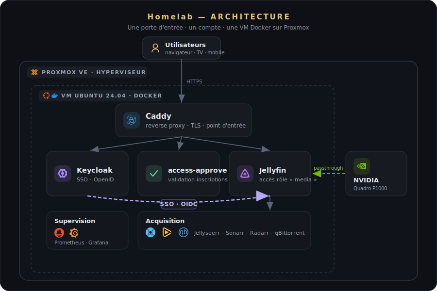
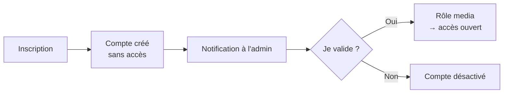

# 🎬 Homelab

**Mon serveur multimédia auto-hébergé — un projet personnel d'apprentissage
autour de Jellyfin, avec authentification unique (SSO) et transcodage GPU.**

> Je débute dans l'auto-hébergement. Ce homelab est mon terrain d'apprentissage —
> documenté honnêtement, avec ce qui marche et ce qu'il me reste à améliorer.

---

## 📖 L'idée

Offrir à ma famille un streaming privé, simple et soigné — accessible depuis le
navigateur, la TV ou le mobile — tout en gardant la maîtrise de mes données et en
apprenant l'administration système au passage.

---

## 🗺️ Architecture

> Une seule porte d'entrée (Caddy), un seul compte (Keycloak), le tout dans une VM Docker
> sur Proxmox — avec le GPU passé directement à Jellyfin pour le transcodage.

  

---

## 🖥️ Matériel

| | |
|---|---|
| **Hyperviseur** | Proxmox VE · Intel Core i7 · GPU NVIDIA Quadro P1000 |
| **VM** | Ubuntu Server 24.04 · 6 vCPU / 12 Go RAM · Docker |
| **Conteneurs** | ~16 services (média · acquisition · SSO · supervision) |

---

## 🧩 Les services

| Domaine | Composants |
|---|---|
| 🎬 **Média** | Jellyfin (+ Jellyfin Enhanced) · Jellyseerr |
| 📥 **Acquisition** | Prowlarr · Sonarr · Radarr · qBittorrent |
| 🔐 **Accès & SSO** | Caddy · Keycloak · access-approve |
| 📊 **Supervision** | Prometheus · Grafana · cAdvisor |

---

## 🗂️ Structure du dépôt

La configuration est versionnée **par domaine** (les secrets restent dans des `.env` non committés) :

| Dossier | Contenu |
|---|---|
| [`media/`](media/) | Jellyfin, Jellyseerr, Prowlarr, Sonarr, Radarr, qBittorrent, FlareSolverr |
| [`auth/`](auth/) | Keycloak (SSO) + le service maison **access-approve** (code inclus) |
| [`proxy/`](proxy/) | Caddy (reverse proxy, TLS) |
| [`monitoring/`](monitoring/) | Prometheus, Grafana, Portainer |

---

## ✨ Fonctionnalités marquantes

🎮 **Transcodage matériel sur GPU (NVENC)** — *le défi qui m'a le plus appris.*
Passer un GPU de laptop à une VM est réputé difficile ; j'y suis arrivé via un firmware OVMF
patché et une table ACPI sur mesure.
→ **[Lire le détail : comment j'ai résolu le transcodage GPU](docs/transcodage-gpu.md)**

🔐 **SSO + validation des inscriptions** — un seul compte (Keycloak) pour tout, sans casser les
applis natives (Quick Connect, login TV par QR code). L'accès est protégé par un rôle : un nouvel
inscrit n'entre **qu'après ma validation** (en un clic, depuis un lien sécurisé).

🎨 **Thème & interface personnalisés** « Homelab » (branding, page d'accueil, écran TV).

---

## 🔒 Sécurité & sauvegardes

- Façade unique avec TLS · SSO côté navigateur · SSH par clé uniquement · `fail2ban`.
- Services d'administration filtrés par réseau (LAN + Tailscale).
- Aucun secret dans le dépôt · sauvegardes régulières des configurations.
- Le durcissement complet fait partie de la roadmap — je n'en suis qu'au début.

---

## 🛤️ Roadmap

**✅ Fait**
- [x] Stack média (Jellyfin + Jellyseerr + *arr)
- [x] SSO Keycloak + applis natives préservées (Quick Connect, login TV par QR)
- [x] Accès par rôle + **validation des inscriptions** (un clic, login-gated)
- [x] [Transcodage matériel GPU (NVENC)](docs/transcodage-gpu.md)
- [x] Thème & interface personnalisés « Homelab »

**🔧 En cours / à faire**
- [ ] Pare-feu hôte avec garde-fou anti-lockout
- [ ] `fail2ban` sur l'authentification native Jellyfin
- [ ] SSO devant tous les services d'administration
- [ ] Accès distant aux services via Tailscale
- [ ] Durcissement Docker (rotation des logs, healthchecks, images figées)

**🌱 À explorer (objectifs d'apprentissage — pas encore démarré)**
- [ ] Apprendre **Ansible** pour automatiser la configuration des services
- [ ] Apprendre **Terraform** pour provisionner l'infrastructure (Infrastructure-as-Code)
- [ ] Notifications & supervision plus poussées

---

Projet personnel · auto-hébergé · en apprentissage continu 🌱

