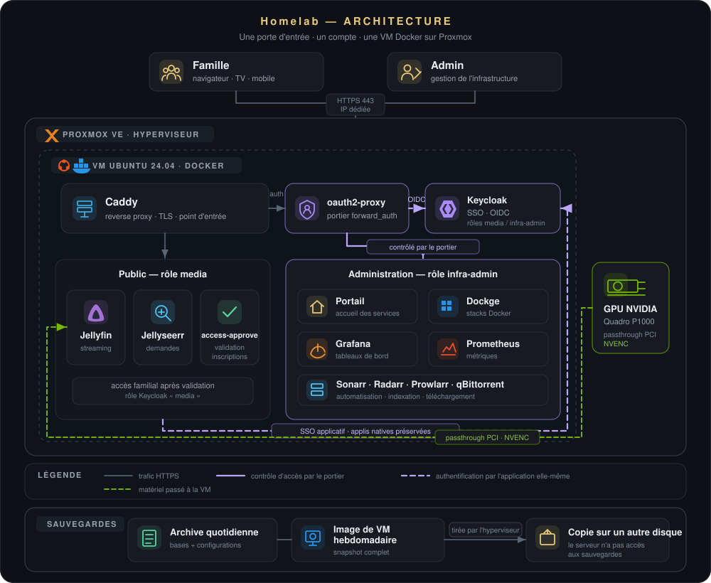
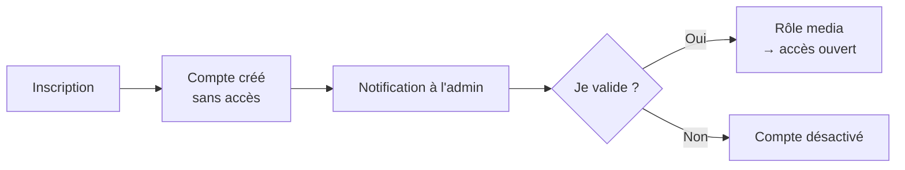

# 🎬 Homelab

**Mon serveur multimédia auto-hébergé — un projet personnel d'apprentissage
autour de Jellyfin, avec authentification unique (SSO) et transcodage GPU.**

> Je débute dans l'auto-hébergement. Ce homelab est mon terrain d'apprentissage —
> documenté honnêtement, avec ce qui marche et ce qu'il me reste à améliorer.

---

## 📖 L'idée

Offrir à ma famille un streaming privé, simple et soigné — accessible depuis le
navigateur, la TV ou le mobile — tout en gardant la maîtrise de mes données et en
apprenant l'administration système au passage.

> 🧭 **Ce projet a beaucoup changé depuis ses débuts.**
> Pour comprendre d'où il vient : **[avant / après, et pourquoi](docs/evolution.md)** —
> chaque brique ajoutée répond à un problème que j'ai rencontré.

---

## 🗺️ Architecture

> Une seule porte d'entrée (Caddy), un seul compte (Keycloak), le tout dans une VM Docker
> sur Proxmox — avec le GPU passé directement à Jellyfin pour le transcodage.

  

---

## 🖥️ Matériel

| | |
|---|---|
| **Hyperviseur** | Proxmox VE · Intel Core i7 · GPU NVIDIA Quadro P1000 |
| **VM** | Ubuntu Server 24.04 · 6 vCPU / 12 Go RAM · Docker |
| **Conteneurs** | ~20 services (média · acquisition · SSO · portail · supervision) |

---

## 🧩 Les services

| Domaine | Composants |
|---|---|
| 🎬 **Média** | Jellyfin (+ Jellyfin Enhanced) · Jellyseerr |
| 📥 **Acquisition** | Prowlarr · Sonarr · Radarr · qBittorrent · FlareSolverr |
| 🔐 **Accès & SSO** | Caddy · Keycloak · oauth2-proxy (passerelle SSO) · access-approve |
| 🧭 **Portail & gestion** | Homarr (portail des services) · Dockge (stacks `compose`) |
| 📊 **Supervision** | Prometheus · Grafana · cAdvisor · exportateur GPU · bot Telegram |
| 💾 **Sauvegardes** | archive quotidienne + image de VM hebdomadaire |

---

## 🗂️ Structure du dépôt

La configuration est versionnée **par domaine** (les secrets restent dans des `.env` non committés) :

| Dossier | Contenu |
|---|---|
| [`media/`](media/) | Jellyfin, Jellyseerr, Prowlarr, Sonarr, Radarr, qBittorrent, FlareSolverr |
| [`auth/`](auth/) | Keycloak (SSO), la [passerelle SSO](auth/sso-gateway/) (oauth2-proxy) et le service maison **access-approve** (code inclus) |
| [`proxy/`](proxy/) | Caddy (reverse proxy, TLS) |
| [`dashboard/`](dashboard/) | Homarr (portail des services) et Dockge (gestion des stacks `compose`) |
| [`monitoring/`](monitoring/) | Prometheus, Grafana (provisionnés par fichiers), exportateur GPU, [bot Telegram](monitoring/telegram-bot/) |
| [`backup/`](backup/) | Scripts de sauvegarde : archive quotidienne + copie tirée par l'hyperviseur |
| [`docs/`](docs/) | Schéma d'architecture, [évolution du projet](docs/evolution.md) et notes détaillées |

---

## ✨ Fonctionnalités marquantes

🎮 **Transcodage matériel sur GPU (NVENC)** — *ce qui m'a le plus appris.*
Passer un GPU de laptop à une VM est réputé difficile ; après pas mal de tâtonnements, j'y suis
arrivé avec un firmware OVMF patché et une petite table ACPI sur mesure.
→ **[Le détail, erreurs comprises](docs/transcodage-gpu.md)**

🔐 **SSO + validation des inscriptions** — un seul compte (Keycloak) pour tout, sans casser les
applis natives (Quick Connect, login TV par QR code). L'accès est protégé par un rôle : un nouvel
inscrit n'entre **qu'après ma validation** (en un clic, depuis un lien sécurisé).

```mermaid
flowchart LR
    A[Inscription] --> B[Compte créé<br/>sans accès]
    B --> C[Notification à l'admin]
    C --> D{Je valide ?}
    D -->|Oui| E[Rôle media<br/>→ accès ouvert]
    D -->|Non| F[Compte désactivé]
```

🚪 **SSO devant *tous* les services d'administration** — plus un mot de passe par outil : Caddy
demande d'abord à une passerelle (`oauth2-proxy`, mode `forward_auth`) si la session Keycloak est
valide **et** si le rôle attendu est présent. Une seule connexion couvre tous les sous-domaines,
et le trafic des applications ne traverse pas la passerelle.
→ **[Comment c'est branché, et ce qui m'a coûté du temps](auth/sso-gateway/)**

💾 **Sauvegardes automatisées à deux niveaux** — une petite archive quotidienne (bases, fichiers
`compose`, configurations, inventaire des versions d'images) et une image complète de la VM chaque
semaine. L'archive est **tirée** par l'hyperviseur, pas poussée par le serveur : un serveur
compromis ne peut pas effacer les sauvegardes.
→ **[La stratégie, la restauration et les limites qui restent](backup/)**

🎨 **Thème & interface personnalisés** « Homelab » (branding, page d'accueil, écran TV).

---

## 🔒 Sécurité & sauvegardes

- Façade unique avec TLS · SSO côté navigateur · SSH par clé uniquement · `fail2ban`.
- **Tous les services d'administration derrière le SSO** (Keycloak + oauth2-proxy, contrôle par
  rôle) ; les anciens accès filtrés par réseau (LAN + Tailscale) restent en repli.
- Aucun secret dans le dépôt (les `.env` ne sont pas versionnés) · sauvegardes automatisées à deux
  niveaux, dont une copie sur un autre disque physique.
- Le durcissement complet fait partie de la roadmap — je n'en suis qu'au début.

---

## 🛤️ Roadmap

**✅ Fait**
- [x] Stack média (Jellyfin + Jellyseerr + *arr)
- [x] SSO Keycloak + applis natives préservées (Quick Connect, login TV par QR)
- [x] Accès par rôle + **validation des inscriptions** (un clic, login-gated)
- [x] [Transcodage matériel GPU (NVENC)](docs/transcodage-gpu.md)
- [x] Thème & interface personnalisés « Homelab »
- [x] [**SSO devant tous les services d'administration**](auth/sso-gateway/) (oauth2-proxy + rôles Keycloak)
- [x] [Sauvegardes automatisées](backup/) : archive quotidienne + image de VM hebdomadaire
- [x] [Supervision provisionnée par fichiers + alertes](monitoring/) (e-mail et Telegram)
- [x] [Portail interne et gestion des stacks](dashboard/) (Homarr, Dockge)

**🔧 En cours / à faire**
- [ ] Pare-feu hôte avec garde-fou anti-lockout
- [ ] `fail2ban` sur l'authentification native Jellyfin
- [ ] **Tester une restauration complète de bout en bout** — jamais fait, donc jamais prouvé
- [ ] Sauvegarde hors du boîtier (la règle 3-2-1 n'est respectée qu'à moitié)
- [ ] Alerter aussi en cas d'**échec** d'une sauvegarde (aujourd'hui : un simple fichier journal)
- [ ] Déconnexion globale du SSO + limitation de débit devant la passerelle
- [ ] Documenter l'accès de repli par Tailscale
- [ ] Durcissement Docker (rotation des logs, healthchecks, images figées partout)

**🌱 À explorer (objectifs d'apprentissage — pas encore démarré)**
- [ ] Apprendre **Ansible** pour automatiser la configuration des services
- [ ] Apprendre **Terraform** pour provisionner l'infrastructure (Infrastructure-as-Code)
- [ ] Superviser l'hyperviseur lui-même, et une sonde externe pour tester le site depuis Internet

---

Projet personnel · auto-hébergé · en apprentissage continu 🌱

