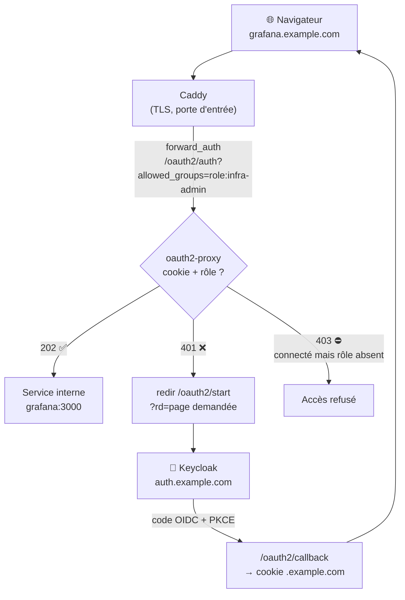

# 🚪 Passerelle SSO — services d'administration

Avant, chaque service d'administration avait **son propre mot de passe** et n'était joignable
que depuis le réseau local (hôtes `*.local`). Ça marchait, mais ça faisait beaucoup de comptes
à gérer — et rien de tout ça n'était accessible proprement depuis l'extérieur.

Maintenant, tous ces services vivent sur un sous-domaine et sont protégés par **une seule
connexion Keycloak**, avec un contrôle par rôle. La brique qui fait ça s'appelle
**oauth2-proxy**, utilisé en mode *portier* (`forward_auth`).

> Je débute avec l'OIDC : cette page décrit ce que j'ai monté et compris, y compris
> les erreurs qui m'ont fait perdre du temps et ce qu'il me reste à corriger.

| Fichier | Contenu |
|---|---|
| [`compose.yaml`](compose.yaml) | Le conteneur oauth2-proxy (mode portier) |
| [`.env.example`](.env.example) | Les deux secrets à fournir |
| [`Caddyfile.snippet`](Caddyfile.snippet) | Le snippet `(ssogate)` + exemples d'hôtes |

---

## 🗺️ Le flux d'une requête

En clair : **Caddy ne sert la page que si oauth2-proxy répond 202.** Le cookie de session est
posé sur `.example.com`, donc une seule connexion suffit pour tous les sous-domaines.

---

## 🧩 Les pièces

| Pièce | Ce qu'elle fait |
|---|---|
| **DNS wildcard** `*.example.com` | Tous les sous-domaines pointent vers la même IP publique |
| **Caddy** | TLS + routage ; appelle la passerelle avant de servir (`forward_auth`) |
| **oauth2-proxy** `v7.15.3` | Vérifie la session et le rôle ; gère le dialogue OIDC avec Keycloak |
| **Keycloak** — client `admin-gate` | Fournisseur d'identité (client *confidential*, PKCE S256) |

---

## 🎭 Deux rôles, deux niveaux d'accès

Le rôle attendu est passé **par hôte**, dans le paramètre `allowed_groups` :

| Rôle de realm | Sous-domaines | Pour qui |
|---|---|---|
| `infra-admin` | `grafana` · `admin` · `prom` · `radarr` · `sonarr` · `prowlarr` · `qbit` · `dockge` | Moi uniquement |
| `media` | `requests` (Jellyseerr) | La famille — pour demander un film ou une série |

Le préfixe `role:` n'est pas décoratif : le provider `keycloak-oidc` d'oauth2-proxy récupère
les **rôles de realm** du jeton et les expose comme des groupes nommés `role:<nom>`.
D'où l'écriture `allowed_groups=role:infra-admin`.

Côté Keycloak, il faut donc que le jeton contienne bien ces rôles (mapper *realm roles*),
et que l'audience du jeton soit `admin-gate` (mapper *audience*). Sans ça, la connexion
réussit… et la passerelle répond quand même 403.

---

## 🤔 Pourquoi `forward_auth` plutôt qu'un proxy complet ?

oauth2-proxy sait aussi jouer le proxy complet (le trafic le traverse). J'ai choisi l'autre
mode — `OAUTH2_PROXY_UPSTREAMS: static://202` — c'est-à-dire **un portier qui ne fait que
répondre oui ou non**, sans jamais toucher au trafic des applications.

| | Proxy complet | Portier (`forward_auth`) ✅ |
|---|---|---|
| **Chemin des données** | Tout passe par oauth2-proxy | Caddy → service, en direct |
| **WebSockets / gros flux** | À surveiller (terminal Dockge, live Grafana) | Rien à faire, ça passe comme avant |
| **Un service = ?** | Souvent un conteneur/une config par service | **Une ligne** dans le Caddyfile |
| **Rôle exigé** | Fixé dans la config du proxy | Variable **par hôte** (`?allowed_groups=…`) |
| **Config Caddy** | Éclatée | Un snippet réutilisé partout |

Le revers, honnêtement : si oauth2-proxy tombe, **plus personne ne se connecte** (Caddy reçoit
une erreur au lieu d'un 202). C'est un point unique de défaillance sur l'authentification —
mais pas sur les données, et le conteneur est en `restart: unless-stopped`.

---

## 🧱 Derrière la passerelle : et le login de chaque appli ?

Une fois la passerelle en place, se retaper un deuxième mot de passe n'avait plus de sens.
J'ai donc désactivé les formulaires natifs, sauf là où je ne voulais pas prendre le risque :

| Service | Ce que j'ai fait |
|---|---|
| **Radarr · Sonarr · Prowlarr** | `<AuthenticationMethod>External</AuthenticationMethod>` — l'appli fait confiance à la passerelle |
| **qBittorrent** | `WebUI\AuthSubnetWhitelist` = sous-réseau Docker du réseau `proxy` |
| **Grafana** | Connexion **native en OIDC** sur le même client `admin-gate` (`auto_login`), avec `infra-admin` → `GrafanaAdmin` |
| **Dockge** | **Garde son propre login** — volontairement : il a accès à `docker.sock` |

Grafana est le cas le plus propre : la passerelle filtre l'accès, puis Grafana ouvre lui-même
une session OIDC. Comme l'utilisateur est déjà connecté à Keycloak, c'est transparent — et
Grafana connaît vraiment *qui* est là, au lieu de faire confiance à un en-tête.

---

## 🐛 Ce qui m'a coûté du temps

**1. « Une page HTML de connexion au lieu du JSON attendu »** — le piège le plus instructif.
Des scripts qui tournent *sur le serveur* (bot de supervision, widgets du tableau de bord)
appelaient les services par leur **adresse publique** : la requête ressortait sur Internet,
retombait sur Caddy, se faisait intercepter par la passerelle, et recevait une redirection
vers la page de login de Keycloak. Résultat : du HTML là où le script attendait du JSON.

> 🩹 La règle que j'en ai tirée : **l'adresse publique, c'est pour un humain dans un navigateur.**
> Entre conteneurs, on passe par le nom interne (`http://prometheus:9090`), qui ne traverse
> jamais la passerelle.

**2. 403 juste après une connexion réussie** — le jeton ne contenait pas les rôles attendus.
Ça se règle côté Keycloak, dans les *protocol mappers* du client `admin-gate` (rôles de realm
dans le jeton + bonne audience), pas côté oauth2-proxy.

**3. `Invalid parameter: redirect_uri`** — chaque sous-domaine a besoin de **sa propre**
URI de redirection déclarée dans Keycloak : `https://<service>.example.com/oauth2/callback`.
Un sous-domaine oublié = une erreur Keycloak sur ce service uniquement.

**4. Une connexion redemandée sur chaque sous-domaine** — il manquait
`OAUTH2_PROXY_COOKIE_DOMAINS=.example.com` (avec le point initial).

**5. Retomber sur la bonne page après le login** — c'est le rôle du `rd=` dans
`/oauth2/start` et de l'en-tête `X-Forwarded-Uri` transmis par Caddy.

---

## 🚀 Mise en place, en résumé

1. **Keycloak** : créer le client `admin-gate` (*confidential*, standard flow, PKCE S256),
   déclarer une URI de redirection par sous-domaine, créer les rôles de realm
   `infra-admin` / `media` et les attribuer.
2. **DNS** : un enregistrement wildcard `*.example.com` vers l'IP publique.
3. **Passerelle** : copier ce dossier dans `/opt/docker/compose/oauth2-proxy/`,
   créer le `.env` à partir de `.env.example`, puis `docker compose up -d`.
4. **Caddy** : ajouter le contenu de `Caddyfile.snippet` au `Caddyfile`, puis
   `docker exec caddy caddy reload --config /etc/caddy/Caddyfile`.
5. **Vérifier** : ouvrir `https://grafana.example.com` en navigation privée →
   redirection vers Keycloak → retour sur Grafana. Avec un compte sans le rôle : accès refusé.

---

## 🛡️ Limites & ce qu'il me reste à améliorer

- 🚧 La passerelle ne protège que **le chemin public**. Un conteneur du réseau `proxy` peut
  toujours joindre `radarr:7878` directement, sans authentification.
- 🚧 Avec `External` sur les `*arr`, l'accès **depuis le réseau local** est lui aussi sans
  mot de passe. C'est un compromis assumé pour l'instant, pas une bonne pratique.
- 🚧 Les anciens accès (`*.local` filtrés par IP, LAN + Tailscale) ont été **conservés comme
  porte de secours** — pratique si la passerelle casse, mais ça fait deux chemins à sécuriser.
- 🚧 La **déconnexion globale** n'est pas encore branchée (`/oauth2/sign_out` + fin de session
  Keycloak) : aujourd'hui je ferme le navigateur.
- 🚧 Pas encore de limitation de débit ni de `fail2ban` devant la passerelle.

🔐 Aucun secret ici : le secret client et la clé de cookie vivent dans un `.env` non versionné.
