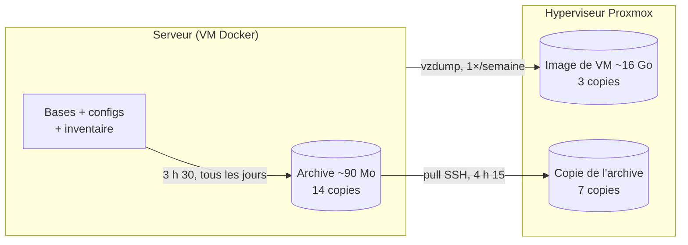

# 💾 Sauvegardes

Tant que je n'avais pas de sauvegarde, chaque manipulation me faisait peur — donc je ne
touchais plus à rien. C'est ce qui m'a poussé à mettre ça en place : pouvoir **casser sans
tout perdre**.

La stratégie tient en deux niveaux : une petite archive **tous les jours**, une image
complète de la VM **toutes les semaines**.

---

## 🎯 La stratégie en deux niveaux

| Niveau | Quoi | Taille | Fréquence | Copies | Où |
|---|---|---|---|---|---|
| **1 — Archive ciblée** | bases de données, fichiers Compose, configurations, inventaire | ~90 Mo | tous les jours à 3 h 30 | 14 | disque de sauvegarde de la VM |
| **2 — Image de la VM** | disque système complet (`vzdump`, snapshot + zstd) | ~16 Go | 1×/semaine, la nuit | 3 | hyperviseur |
| **+ Copie décalée** | l'archive du niveau 1, **tirée** par l'hyperviseur | ~90 Mo | tous les jours à 4 h 15 | 7 | **autre disque physique** |

**Pourquoi deux niveaux ?** Ils ne répondent pas à la même question :

- le **niveau 1** répond à *« j'ai cassé une config / perdu une base hier soir »* — léger, quotidien,
  restauration en quelques minutes ;
- le **niveau 2** répond à *« la VM ne démarre plus du tout »* — lourd, hebdomadaire, mais il
  remonte le serveur entier sur une machine vierge.



---

## 📦 Ce que je sauvegarde — et ce que je laisse de côté

**Sauvegardé** (tout ce qui ne se retrouve nulle part ailleurs) :

| Élément | Pourquoi |
|---|---|
| Base **Keycloak** (`pg_dump`) | comptes, rôles, clients OIDC — impossible à recréer à l'identique |
| Base d'une autre application du serveur (`pg_dump`, si présente) | ses données de fonctionnement |
| Base **SQLite** du portail Homarr (`VACUUM INTO`) | la mise en page du tableau de bord, faite à la main |
| `compose/`, `config/`, `data/` des services | tout ce que j'ai réglé service par service (y compris les `.env`) |
| **Inventaire** du système | liste des conteneurs et **versions des images**, cron, disques, ports en écoute |

**Non sauvegardé** — volontairement, et c'est ce qui fait tenir l'archive en 90 Mo :

| Élément | Pourquoi |
|---|---|
| Médiathèque (~220 Go) | re-téléchargeable ; la sauvegarder coûterait des heures pour rien |
| Métriques **Prometheus** | historique de supervision : agréable à garder, pas vital |
| Cache et métadonnées **Jellyfin** | régénérés automatiquement (affiches, images d'aperçu) |
| Transcodages temporaires | fichiers jetables par nature |

> 🧾 L'**inventaire** (`manifest.txt`) est le fichier que je sous-estimais au début : six mois plus
> tard, c'est lui qui me dira *quelle version d'image* tournait et *quels ports* étaient ouverts.

---

## 🕒 Planning

| Quand | Où | Quoi |
|---|---|---|
| `30 3 * * *` | serveur | [`backup-configs.sh`](backup-configs.sh) → `/srv/backup/homelab/` |
| `15 4 * * *` | hyperviseur | [`pull-backup.sh`](pull-backup.sh) → copie sur un autre disque |
| 1×/semaine, la nuit | hyperviseur | tâche `vzdump` de Proxmox (mode *snapshot*, zstd, `keep-last=3`) |

Les 45 minutes d'écart entre 3 h 30 et 4 h 15 laissent le temps à l'archive d'être terminée
et fermée avant d'être copiée.

---

## 🧩 Trois choix que j'ai dû justifier

**1. Aucun `sudo` dans le script.** Une partie des données des services appartient à `root`, et
le compte qui exécute le cron n'a pas les droits d'administrateur. Plutôt que d'élargir ses
droits, le script lance un conteneur `alpine` jetable qui monte le dossier **en lecture seule**
et écrit l'archive. Le script ne gagne aucun privilège permanent sur l'hôte.

**2. « Pull » et non « push ».** Le serveur est exposé sur Internet ; l'hyperviseur, non.
Si le serveur poussait ses sauvegardes, il lui faudrait un accès SSH vers l'hyperviseur —
autrement dit, un serveur compromis pourrait effacer *toutes* les sauvegardes, y compris les
images de VM. C'est donc l'hyperviseur qui va chercher l'archive : le sens de la connexion
va du plus protégé vers le moins protégé.

**3. Des dumps, pas des copies de fichiers.** Copier à chaud les fichiers d'une base en cours
d'écriture donne souvent une copie inutilisable. D'où `pg_dump` pour PostgreSQL et
`VACUUM INTO` pour SQLite — deux façons d'obtenir une copie **cohérente** sans arrêter le service.

> 🔐 L'archive contient les fichiers `.env` : elle est donc créée en `chmod 600`.
> Elle n'est pas chiffrée — voir « ce qu'il me reste à améliorer ».

---

## 🧯 Restaurer

**Un fichier de configuration** (l'archive du jour contient une archive `configs.tar.gz`) :

```bash
tar xzf homelab-AAAAMMJJ_HHMM.tar.gz configs.tar.gz
tar xzf configs.tar.gz services/compose/jellyfin/compose.yaml
```

**La base Keycloak** :

```bash
docker compose stop keycloak                       # personne n'écrit pendant la restauration
docker exec -i keycloak-postgres sh -c 'psql -U "$POSTGRES_USER" -d "$POSTGRES_DB"' < keycloak.sql
docker compose start keycloak
```

> ⚠️ Sur une base déjà peuplée, il faut d'abord la recréer (`dropdb` / `createdb`) : sinon
> le dump échoue sur des objets qui existent déjà. Je m'en suis rendu compte en essayant.

**Le portail Homarr (SQLite)** : arrêter le conteneur, remettre `homarr.sqlite` à la place de
`db.sqlite`, redonner le bon propriétaire, redémarrer.

**La VM entière**, depuis l'hyperviseur :

```bash
qmrestore /chemin/vers/dump/vzdump-qemu-101-AAAA_MM_JJ-HH_MM_SS.vma.zst 101 --storage <stockage>
```

**Après un sinistre complet**, l'ordre compte :

1. restaurer l'image de VM (elle date d'au plus une semaine) ;
2. appliquer par-dessus la **dernière archive du niveau 1** — bases et configurations à jour ;
3. recréer le disque de la médiathèque (vide) et relancer les téléchargements.

---

## 🪤 La leçon : ma première sauvegarde de VM a échoué

Premier `vzdump` lancé tel quel, sans rien régler :

```
INFO:  78% (398.7 GiB of 510.0 GiB) in 21m 8s, read: 171.8 MiB/s, write: 159.0 MiB/s
ERROR: vma_queue_write: write error - Broken pipe
ERROR: Backup of VM 101 failed - vma_queue_write: write error - Broken pipe
```

**510 Gio.** En regardant le début du journal, j'ai compris : Proxmox sauvegardait *tous* les
disques de la VM — le disque système, mais aussi la **médiathèque** et… le **disque qui contient
déjà mes sauvegardes**. Le disque de destination ne pouvait pas absorber ça, et l'écriture s'est
interrompue à 78 %, après 21 minutes.

Le correctif ne se trouve pas dans le script mais dans la définition de la VM : marquer les
disques concernés comme **exclus de la sauvegarde** (case *Backup* décochée dans l'interface,
`backup=0` en ligne de commande). Le journal le dit alors explicitement :

```
INFO: include disk 'scsi0' 'stockage:101/vm-101-disk-1.raw' 60G
INFO: exclude disk 'scsi1' 'stockage:101/vm-101-disk-0.raw' (backup=no)   # médiathèque
INFO: exclude disk 'scsi2' 'stockage:101/vm-101-disk-2.raw' (backup=no)   # disque de sauvegarde
INFO: backup mode: snapshot
...
INFO: backup is sparse: 26.16 GiB (43%) total zero data
INFO: transferred 60.00 GiB in 238 seconds (258.2 MiB/s)
INFO: archive file size: 16.34GB
INFO: Finished Backup of VM 101 (00:03:59)
```

| | Avant | Après |
|---|---|---|
| Disques inclus | 3 disques — 510 Gio | 1 disque système — 60 Gio |
| Résultat | échec à 78 % après 21 min | **16,34 Go en 3 min 59 s** |

Ce que j'en retiens : une sauvegarde n'est pas « tout copier ». Décider **ce qu'on n'inclut pas**
est la moitié du travail — et c'est ce qui fait la différence entre une tâche qui échoue chaque
semaine et une tâche de quatre minutes qui passe inaperçue.

---

## 🔎 Vérifier que ça tourne

```bash
tail -3 ~/logs/backup.log            # sur le serveur
ls -lh /srv/backup/homelab/ | tail   # les 14 dernières archives
```

---

## ⚠️ Risque résiduel & ce qu'il me reste à améliorer

Je préfère l'écrire noir sur blanc plutôt que de faire croire que le sujet est réglé :

- 🔴 **Tout est dans le même boîtier.** Les disques de la VM *et* les images `vzdump` vivent sur
  le même SSD NVMe. Seule la copie tirée par l'hyperviseur est sur un autre disque physique —
  et elle ne contient que l'archive de 90 Mo, pas l'image de la VM. Un vol, un incendie ou une
  surtension emporterait l'ensemble. La règle **3-2-1** n'est donc respectée qu'à moitié :
  prochaine étape, un disque externe ou un stockage distant.
- 🟠 **La restauration complète n'a pas encore été testée** de bout en bout. Une sauvegarde non
  testée reste une hypothèse — c'est la première chose que je veux corriger.
- 🟠 **Pas d'alerte en cas d'échec** : le résultat part dans un fichier journal que je dois penser
  à lire. Une notification (bot / e-mail) serait plus honnête.
- 🟡 **Archive non chiffrée**, protégée uniquement par les permissions `600`. Acceptable tant
  qu'elle ne quitte pas la maison, plus du tout si je l'envoie un jour hors du réseau.
- 🟡 **La clé SSH du « pull » n'est pas restreinte.** Je devrais la limiter dans
  `authorized_keys` (`restrict`, `command="..."`) pour qu'elle ne serve qu'à lire les archives.

---

<sub>Les chemins, noms d'hôtes et adresses IP de ce dossier sont ceux d'un exemple neutre.</sub>
