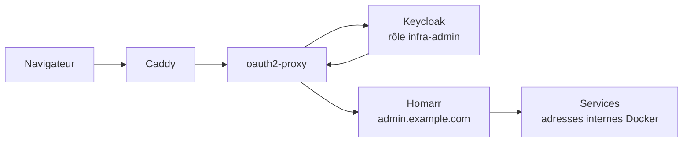

# 🧭 Portail & gestion des conteneurs

Une seule page pour retrouver tous les services, et un outil pour gérer les stacks Docker.

| Service | Rôle | Adresse |
|---|---|---|
| **Homarr** | Portail : raccourcis, widgets, panneaux Grafana intégrés | `admin.example.com` |
| **Dockge** | Gestion des stacks `docker compose` | `dockge.example.com` |

> Les deux sont derrière le **portail SSO** (Caddy → oauth2-proxy → Keycloak, rôle `infra-admin`).
> Aucun des deux ne publie de port : ils ne sont joignables qu'à travers le reverse proxy.

---

## 📖 Pourquoi un portail

Avant, je gardais une dizaine de favoris dans le navigateur, avec des ports à retenir
(`:7878`, `:8989`, `:9696`…) et des adresses différentes selon que j'étais à la maison ou non.
Depuis que chaque service a son sous-domaine derrière le SSO, il manquait juste la **porte d'entrée** :
une page unique qui liste tout et montre l'état du serveur d'un coup d'œil.



---

## 🏠 Homarr — le tableau de bord

**Version épinglée (`v1.72.0`).** Le projet bouge vite ; avec `:latest`, un simple redémarrage
peut ramener une version qui change la mise en page. Je monte de version quand je le décide,
pas quand Docker le décide.

### Connexion

| Réglage | Valeur | Pourquoi |
|---|---|---|
| `AUTH_PROVIDERS` | `oidc,credentials` | OIDC pour l'usage normal, compte local gardé **en secours** si Keycloak tombe |
| `AUTH_OIDC_ISSUER` | `https://auth.example.com/realms/homelab` | Le realm Keycloak du homelab |
| `AUTH_OIDC_GROUPS_ATTRIBUTE` | `groups` | Le claim qui transporte les groupes |

Homarr n'a pas de champ « groupe admin » : il fait correspondre les groupes reçus **par leur nom**.
J'ai donc créé côté Keycloak un mapper *realm roles → claim `groups`*, et côté Homarr un groupe
nommé exactement `infra-admin` avec la permission `admin`. Résultat : le même rôle Keycloak sert
à la fois au portail SSO (qui laisse passer la requête) et à Homarr (qui accorde les droits admin).

> 🔓 Le fournisseur `credentials` reste actif : c'est un compromis assumé. S'il n'y avait que l'OIDC,
> une panne de Keycloak me fermerait aussi la porte du portail.

### Intégrations : adresses **internes**, pas publiques

Les intégrations (Radarr, Sonarr, Prowlarr, qBittorrent, Jellyfin, Jellyseerr, Proxmox) pointent
vers les noms de conteneurs sur le réseau Docker :

```
http://radarr:7878        et non  https://radarr.example.com
http://jellyfin:8096      et non  https://example.com
```

Deux raisons :

1. **Le portail SSO bloquerait les appels API.** Une requête vers l'adresse publique reçoit une
   redirection 302 vers Keycloak — Homarr recevrait du HTML de page de connexion au lieu du JSON.
2. **Les clés d'API ne sortent jamais du réseau Docker** : pas d'aller-retour par Internet pour
   afficher une file de téléchargement.

En revanche, les **raccourcis cliquables** de la carte pointent bien vers les adresses publiques
(`https://radarr.example.com`, …) : c'est le navigateur qui les ouvre, et lui passe par le SSO.
Seule exception, Proxmox, qui n'est pas derrière le proxy : `https://192.168.1.20:8006`.

### Ce qu'il y a sur la carte

| Bloc | Contenu |
|---|---|
| 🔗 **Raccourcis** | 10 services (média, acquisition, supervision, SSO, Dockge) |
| 🎬 **Média** | Calendrier des sorties · téléchargements en cours · « en train de regarder » · demandes de films |
| 🖥️ **Serveur** | Santé de l'hyperviseur (Proxmox) · 6 panneaux Grafana en iframe |
| 🌤️ **Divers** | Horloge · météo · flux d'actualités |

---

## 📊 Intégrer des panneaux Grafana

Grafana sait servir **un seul panneau**, sans menu ni barre latérale, via l'URL `d-solo` :

```
https://grafana.example.com/d-solo/<UID_DU_DASHBOARD>/<slug>?orgId=1&panelId=1&theme=dark&refresh=30s&from=now-6h&to=now
```

Deux obstacles, dans cet ordre :

**1. Cadre vide, erreur `X-Frame-Options: deny`.**
Grafana refuse par défaut d'être affiché dans une iframe. Il faut l'autoriser explicitement :

```yaml
environment:
  - GF_SECURITY_ALLOW_EMBEDDING=true
```

**2. Toujours vide : l'iframe n'a pas de session Grafana.**
Sans session, Grafana renvoie vers Keycloak pour se connecter… et Keycloak, lui, refuse d'être
affiché dans une iframe. La boucle ne peut pas aboutir. La solution retenue : autoriser la lecture
anonyme.

```yaml
environment:
  - GF_AUTH_ANONYMOUS_ENABLED=true
  - GF_AUTH_ANONYMOUS_ORG_ROLE=Viewer
```

> ⚖️ **Le compromis, dit honnêtement :** « anonyme » ne veut pas dire « ouvert à tous ».
> Le sous-domaine `grafana.example.com` reste **entièrement derrière le portail SSO** : aucune
> requête n'atteint Grafana sans avoir été validée par Keycloak avec le rôle `infra-admin`.
> L'anonymat ne joue qu'**à l'intérieur** de cette barrière — Grafana ne sait plus *qui* regarde,
> mais seuls des utilisateurs déjà authentifiés peuvent regarder. Si un jour j'expose Grafana
> directement, ce réglage devra sauter.

Détail qui m'a fait perdre du temps : le cookie de session traverse bien l'iframe **parce que**
`admin.example.com` et `grafana.example.com` partagent le même domaine parent. Avec deux domaines
différents, les cookies `SameSite` seraient tombés et rien n'aurait fonctionné.

---

## 🧰 Dockge à la place de Portainer

J'ai utilisé Portainer pendant les premières semaines, puis je l'ai retiré. Ce n'est pas un mauvais
outil — il ne correspondait simplement plus à ma façon de travailler.

| | Portainer CE | Dockge |
|---|---|---|
| Stockage des stacks | Dans **sa propre base** | De **vrais fichiers** `compose.yaml` sur le disque |
| Périmètre | Conteneurs, images, volumes, réseaux, registres… | Uniquement les stacks compose |
| Fonctions payantes | Une partie réservée à la licence Business | Aucune |
| Accès au démon Docker | `docker.sock` requis | `docker.sock` requis **aussi** |

**Ce qui a fait pencher la balance :**

- **Les fichiers restent des fichiers.** Dockge écrit dans `/opt/docker/compose/<stack>/compose.yaml` —
  exactement les fichiers que j'édite en SSH et que je copie dans ce dépôt. Avec Portainer, un stack
  créé depuis l'interface vivait dans sa base : impossible à versionner simplement, et à récupérer
  seulement depuis son volume. Ici, l'interface web et la ligne de commande travaillent sur la même
  source de vérité.
- **Pas de fonctions grisées.** Portainer CE affiche des fonctionnalités réservées à la licence
  Business (gestion fine des droits, fonctions d'équipe…). Pour un homelab d'apprentissage, je préfère
  un outil dont je vois tout le périmètre.
- **Moins d'outil pour le même besoin.** Je ne faisais que démarrer/arrêter des stacks et lire des logs.

**Ce que je n'ai pas gagné, et qu'il faut dire :** Dockge monte lui aussi `/var/run/docker.sock`.
Qui contrôle ce socket contrôle l'hôte — le changement d'outil **n'apporte aucun gain de sécurité**
sur ce point. La seule protection réelle reste la même pour les deux : aucun port publié, et le
portail SSO devant.

**Ce que j'ai perdu :** l'inventaire des images, volumes et réseaux, et la gestion multi-serveurs.
Pour ça, je repasse en ligne de commande — ce qui, pour apprendre, n'est pas une perte.

### Le piège de l'installation

Le répertoire des stacks doit avoir **le même chemin dedans et dehors** :

```yaml
volumes:
  - /opt/docker/compose:/opt/docker/compose   # même chemin des deux côtés
environment:
  - DOCKGE_STACKS_DIR=/opt/docker/compose
```

Dockge ne lance pas `docker compose` lui-même : il le fait exécuter par le démon de l'hôte, qui
résout les chemins **côté hôte**. Avec un montage du type `/opt/docker/compose:/app/stacks`, les
stacks s'affichent bien dans l'interface mais refusent de démarrer.

---

## 🗂️ Fichiers

| Fichier | Contenu |
|---|---|
| [`homarr/compose.yaml`](homarr/compose.yaml) | Le portail, version épinglée |
| [`homarr/.env.example`](homarr/.env.example) | Variables attendues (secrets à remplacer) |
| [`dockge/compose.yaml`](dockge/compose.yaml) | Gestion des stacks compose |

---

## 🌱 Ce qu'il me reste à améliorer

- [ ] **La carte Homarr n'est pas versionnée** : elle vit dans une base SQLite. Mes `compose.yaml`
      sont dans Git, mais pas la disposition du tableau de bord — pour l'instant, seule une sauvegarde
      du dossier `/appdata` me protège.
- [ ] Revenir sur le **Viewer anonyme** de Grafana si un jour le sous-domaine sort de derrière le SSO.
- [ ] Réduire l'exposition du `docker.sock` (proxy socket en lecture seule, par exemple).
- [ ] Supprimer le fournisseur `credentials` de Homarr une fois le SSO jugé assez fiable.
