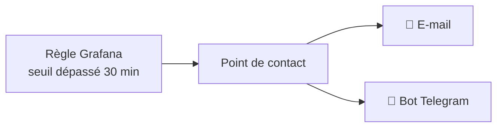

# 📊 Supervision

Savoir ce que fait le serveur — et être prévenu **avant** que ça casse.

Au départ j'avais des tableaux de bord cliqués à la souris : jolis, mais perdus au
premier conteneur recréé. J'ai tout repris **sous forme de fichiers**, versionnés ici.

---

## 🧩 Le stack

| Service | Rôle |
|---|---|
| **Prometheus** | Collecte et stocke les métriques (15 jours d'historique) |
| **Grafana** | Tableaux de bord, alertes et notifications |
| **node-exporter** | Métriques de la machine : CPU, RAM, disques, réseau |
| **cAdvisor** | Métriques par conteneur Docker |
| **nvidia_gpu_exporter** | Métriques du GPU NVIDIA (voir plus bas) |
| **[bot Telegram](telegram-bot/)** | Consulter l'état du serveur depuis le téléphone + veille sur les conteneurs |

> La gestion des conteneurs se fait maintenant en ligne de commande et via les
> fichiers `compose` de ce dépôt. J'ai retiré Portainer, que j'utilisais au début,
> au profit de Dockge — le pourquoi est détaillé dans [`dashboard/`](../dashboard/).

---

## 🧾 La supervision comme du code

Grafana lit un dossier `provisioning/` au démarrage et applique ce qu'il y trouve.
Plus rien n'est configuré à la main : si je recrée le conteneur, tout revient à l'identique.

```
provisioning/
├── datasources/prometheus.yml    # la source de données (uid FIXE)
├── dashboards/dashboards.yml     # charge les .json d'un dossier
└── alerting/
    ├── contact-points.yml        # où partent les alertes
    ├── policies.yml              # qui reçoit quoi
    └── rules.yml                 # les règles elles-mêmes
```

Deux réglages font toute la différence :

| Réglage | Pourquoi |
|---|---|
| `uid: homelab-prometheus` | Un identifiant **choisi par moi**, pas généré au hasard : les tableaux de bord et les règles d'alerte y font référence. Sans ça, tout se casse à la reconstruction. |
| `allowUiUpdates: false` | Les modifications faites à la souris ne sont pas conservées. Contraignant au début, mais c'est ce qui garantit que le dépôt correspond à la réalité. |

Côté Prometheus, la liste des cibles à interroger est elle aussi un simple fichier :
[`prometheus-grafana/prometheus.yml`](prometheus-grafana/prometheus.yml). Ajouter une
nouvelle source de métriques = ajouter quatre lignes.

> 📁 Sur le serveur, ces fichiers vivent dans `/opt/docker/config/grafana/` et sont
> montés en **lecture seule** dans le conteneur. Les copies d'exemple sont ici,
> avec des valeurs obfusquées.

---

## 🔔 Les alertes

Je surveille en priorité le **remplissage des disques** : c'est la panne la plus
probable dans mon cas (téléchargements + cache de transcodage), et celle qui casse
le plus de choses d'un coup.

| Règle | Seuil | Gravité |
|---|---|---|
| Disque de la médiathèque | moins de **12 %** d'espace libre | `warning` |
| Disque système (`/`) | moins de **15 %** d'espace libre | `critical` |

Le seuil du disque système est volontairement **plus haut** : s'il se remplit,
Docker, les bases de données et les journaux tombent en même temps.

L'expression PromQL est la même dans les deux cas — un simple pourcentage d'espace libre :

```promql
100 * node_filesystem_avail_bytes{mountpoint="/",fstype="ext4"}
    / node_filesystem_size_bytes{mountpoint="/",fstype="ext4"}
```

**`for: 30m`** — la condition doit rester vraie 30 minutes d'affilée avant de
déclencher. Sans ce délai, un gros téléchargement temporaire me réveillait pour
rien : c'est le réglage que j'ai le plus tâtonné.

### Où arrivent les alertes

Deux canaux, le même message :



Le jeton du bot et l'adresse e-mail ne sont **pas** dans les fichiers de règles :
ils sont injectés depuis l'environnement (`${TG_BOT_TOKEN}`, `${ALERT_EMAIL_TO}`),
lu dans un `grafana.env` non versionné — modèle :
[`grafana.env.example`](prometheus-grafana/grafana.env.example).

---

## 🎮 Les métriques du GPU

Depuis que Jellyfin transcode sur le GPU, je voulais voir **ce qui se passe pendant
un transcodage**. Un petit exportateur lance `nvidia-smi` à intervalle régulier et
publie le résultat au format Prometheus.

| Métrique | Ce que je regarde |
|---|---|
| `nvidia_smi_temperature_gpu` | Température de la carte |
| `nvidia_smi_utilization_gpu_ratio` | Charge du processeur graphique |
| `nvidia_smi_memory_used_bytes` | Mémoire vidéo consommée |
| `nvidia_smi_encoder_stats_session_count` | **Nombre de transcodages en cours** |
| `nvidia_smi_power_draw_watts` | Consommation électrique |

La dernière ligne est celle qui m'a le plus servi : elle confirme d'un coup d'œil
que le transcodage part bien sur le GPU, et non sur le CPU.

> ⚙️ Le conteneur ne demande que `NVIDIA_DRIVER_CAPABILITIES=utility` : on se
> contente de **lire** des compteurs, inutile de lui donner plus de droits.
> Voir [`gpu-exporter/compose.yaml`](gpu-exporter/compose.yaml).

### 🧱 Le piège : pas de température CPU

J'ai longtemps cherché pourquoi aucun capteur thermique du processeur ne remontait.
La réponse est simple : **le serveur est une machine virtuelle**. `/sys/class/hwmon`
n'y contient aucun capteur de température — l'hyperviseur ne les expose pas à
l'invité, donc `node-exporter` n'a tout simplement rien à collecter.

Conséquence assumée : **la seule température supervisée est celle du GPU**, qui est
passé directement à la VM et remonte ses propres capteurs. Pour le CPU, il faudrait
superviser l'hyperviseur lui-même — c'est sur ma liste.

---

## 🖼️ Un tableau de bord « tuiles »

À côté des tableaux de bord classiques, j'en maintiens un dédié à l'**intégration
dans le portail interne** : panneaux au fond transparent, gros chiffres, ni titres
ni légendes — chaque panneau est affiché seul dans une tuile du portail.

Il donne l'essentiel en un écran : CPU, RAM, température GPU, remplissage des trois
disques et trafic réseau.

> ⚠️ L'affichage en iframe demande `GF_SECURITY_ALLOW_EMBEDDING=true`. Ce n'est
> acceptable que parce que le portail est **déjà** protégé en amont par le reverse
> proxy et le SSO. Exposé tel quel sur Internet, ce serait une erreur.

---

## 🛤️ Ce qu'il me reste à faire

- [ ] Alerter sur les conteneurs qui redémarrent en boucle
- [ ] Superviser l'hyperviseur (et récupérer enfin la température CPU)
- [ ] Une sonde externe pour vérifier que le site répond depuis Internet
- [ ] Versionner aussi les `.json` des tableaux de bord que j'ai écrits moi-même

---

> 🔐 Aucun secret dans ce dossier : mots de passe, jeton du bot et secret SSO
> vivent dans des `.env` **non versionnés** (modèles `*.env.example`).
