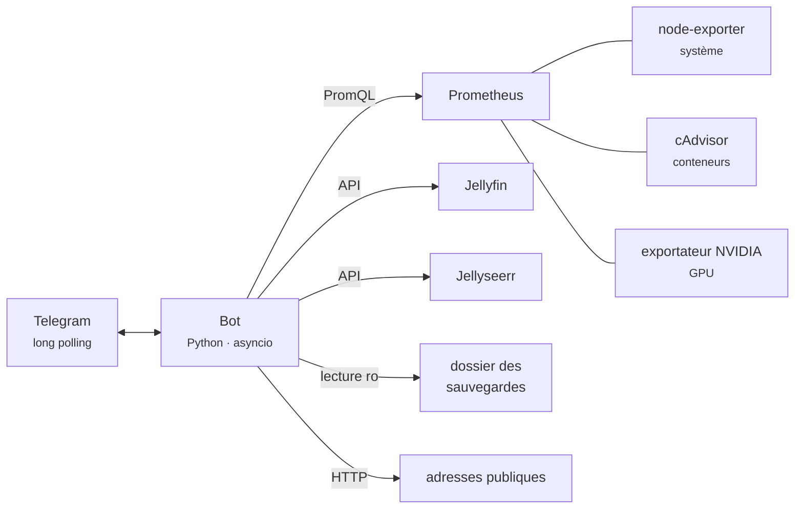

# 🤖 Bot Telegram de supervision

Un petit **pupitre de contrôle dans Telegram** pour surveiller le homelab depuis le
téléphone, sans ouvrir de session SSH. Code maison (Python + `python-telegram-bot`).

> Je débute : ce bot fait volontairement peu de choses, mais il les fait en
> **lecture seule**. Il ne redémarre rien et ne supprime rien — c'était la contrainte
> que je me suis fixée avant d'écrire la première ligne.

---

## 🎛 Ce qu'il affiche

Le menu tient en huit boutons (plus « 🔎 Tout vérifier », qui regroupe les quatre premiers) :

| Bouton | Contenu | Source |
|---|---|---|
| 📊 **Serveur** | Temps de fonctionnement, processeur, charge, mémoire, swap | Prometheus / node-exporter |
| 💾 **Disques** | Occupation et espace libre par point de montage (⚠️ au-delà de 88 %) | Prometheus / node-exporter |
| 🐳 **Conteneurs** | Nombre de conteneurs actifs + ceux qui manquent à l'appel | Prometheus / cAdvisor |
| 🎮 **Carte graphique** | Utilisation, mémoire vidéo, température, consommation, transcodages | Exportateur NVIDIA |
| 🎬 **En lecture** | Qui regarde quoi, sur quel appareil, en direct ou en transcodage | API Jellyfin |
| 🎯 **Demandes** | Dernières demandes de contenus et leur état | API Jellyseerr |
| 💽 **Sauvegardes** | Âge et taille de la dernière archive, volume total | Dossier monté en lecture seule |
| 🌐 **Services** | Code HTTP et temps de réponse des adresses publiques | Requêtes HTTP |

Chaque rubrique se termine par l'heure de mise à jour et deux boutons : **⬅️ Menu** et
**🔄 Actualiser** (le message est modifié sur place, pas de conversation qui s'allonge).

Deux commandes existent aussi : `/menu` (ouvrir le pupitre) et `/etat` (raccourci vers
la rubrique Serveur).

### 🔌 D'où viennent les données



Le bot **n'ouvre aucun port** : c'est lui qui interroge Telegram. Il joint les services par
leur **nom de conteneur** sur le réseau Docker interne — jamais par leur adresse publique,
qui passerait par la passerelle SSO et renverrait une page de connexion au lieu de données.

### 📋 Exemples de rendu

<table>
<tr><td>

**📊 Serveur**

```
📊 Serveur homelab

⏱ En ligne : 12 j 4 h 37 min
🧠 Processeur : 8 %  ▰▱▱▱▱▱▱▱▱▱
⚙️ Charge : 0.42 / 0.51
   (7 % de 6 cœurs)
💭 Mémoire : 6.8 / 11.7 Gio
   ▰▰▰▰▰▰▱▱▱▱
♻️ Swap : 0 %

màj 21:14:03
```

</td><td>

**💾 Disques**

```
💾 Disques

Système
▰▰▰▰▰▰▱▱▱▱ 58 %
libre 25.4 Gio sur 60.0 Gio

Médiathèque ⚠️
▰▰▰▰▰▰▰▰▱▱ 79 %
libre 66.8 Gio sur 316.9 Gio

Sauvegardes
▰▱▱▱▱▱▱▱▱▱ 5 %
libre 139.0 Gio sur 157.4 Gio
```

</td></tr>
<tr><td>

**🎮 Carte graphique**

```
🎮 Carte graphique

⚡ Utilisation : 34 %  ▰▰▰▱▱▱▱▱▱▱
🧠 Mémoire vidéo : 412 / 4096 Mio
🌡 Température : 61 °C
🔌 Consommation : 27 W
🎞 Transcodages actifs : 1
```

</td><td>

**🎬 En lecture**

```
🎬 En lecture (2)

▶️ utilisateur1 — Un film · 42 %
    Salon (TV) · lecture directe
⏸ utilisateur2 — Une série — S02E04 · 8 %
    Téléphone · transcodage
```

</td></tr>
<tr><td>

**💽 Sauvegardes**

```
💽 Sauvegardes ciblées

🟢 Dernière :
   sauvegarde-20260728_0330.tar.gz
   88 Mio · il y a 9 h

📦 Archives conservées : 14
📊 Volume total : 1 208 Mio

Quotidien 3 h 30 · copie 4 h 15
```

</td><td>

**🌐 Services**

```
🌐 Disponibilité des services

🟢 Site / Jellyfin — 200 · 84 ms
🟢 Keycloak — 200 · 121 ms
🟢 Portail — 302 · 45 ms
🔴 Demandes — ConnectError
```

</td></tr>
</table>

Le bouton **🔎 Tout vérifier** enchaîne serveur, disques, conteneurs et disponibilité en un
seul message — les quatre requêtes partent **en parallèle**, la réponse arrive en une seconde.

---

## 🔔 La veille (watchdog)

Une tâche de fond compare **chaque minute** la liste des conteneurs actifs :

- un conteneur absent sur **deux relevés consécutifs** (~2 min) → notification `🔴` ;
  s'il fait partie des services essentiels, c'est signalé,
- son retour → notification `🟢`.

Les deux relevés évitent le bruit : un simple redémarrage ou une mise à jour d'image
ne déclenche pas d'alerte.

```
🔴 Conteneur jellyfin hors ligne (~2 min) ⚠️ service essentiel
🟢 Conteneur jellyfin de nouveau actif
```

C'est la seule chose que le bot envoie **de lui-même** : le reste, il attend qu'on le lui
demande. Et comme le même jeton sert de canal de notification à Grafana, les alertes de
remplissage des disques arrivent dans la même conversation — un seul endroit à regarder.

---

## 🧠 Quelques choix techniques

| Choix | Pourquoi |
|---|---|
| **Message modifié sur place** plutôt qu'un nouveau message | la conversation ne s'allonge pas ; « Actualiser » remplace le contenu et non la page |
| **Requêtes en parallèle** (`asyncio.gather`) pour « Tout vérifier » et la disponibilité | quatre appels séquentiels prendraient plusieurs secondes |
| **Erreurs isolées par rubrique** | si Jellyseerr ne répond pas, seule sa rubrique affiche `⚠️`, le reste du pupitre continue de fonctionner |
| **Barres en caractères** (`▰▱`) plutôt que des images | lisible partout, y compris en notification, et zéro dépendance graphique |
| **Deux relevés avant d'alerter** | évite une alerte à chaque mise à jour d'image |
| **Filtrage du chat dès la première ligne** de chaque gestionnaire | un inconnu qui trouve le bot n'obtient aucune réponse, pas même une erreur |

### ⚙️ Variables d'environnement

| Variable | Rôle | Défaut |
|---|---|---|
| `BOT_TOKEN` | jeton donné par @BotFather | — (obligatoire) |
| `ALLOWED_CHAT` | identifiant du seul chat autorisé | — (obligatoire) |
| `JF_TOKEN` / `JS_TOKEN` | clés API Jellyfin / Jellyseerr (lecture) | vide |
| `PROM_URL`, `JF_URL`, `JS_URL`, `GPU_URL` | adresses internes des services | noms de conteneurs |
| `BACKUP_DIR` | dossier des archives, monté en `:ro` | `/backups` |
| `SERVER_NAME` | étiquette affichée dans les titres | `homelab` |

---

## 🔒 Pourquoi pas de `docker.sock`

C'est le point sur lequel j'ai le plus réfléchi avant d'écrire le bot.

Pour lister des conteneurs, le réflexe est de monter `/var/run/docker.sock` dans le
conteneur. Mais ce socket donne le **contrôle total du démon Docker** — donc, en pratique,
un accès équivalent à **root sur l'hôte** : créer un conteneur privilégié, monter `/`,
lire n'importe quel fichier. Un bot exposé à Internet via l'API Telegram est exactement
le genre de service à qui il ne faut pas confier cela.

L'état des conteneurs vient donc de la métrique `container_last_seen` de **cAdvisor**,
lue à travers **Prometheus** : un conteneur vu il y a moins de deux minutes est
considéré actif. C'est un peu moins précis qu'un `docker ps`, et c'est suffisant.

Le reste suit le même principe de **moindre privilège** :

| | |
|---|---|
| 🚫 Pas de socket Docker | l'état vient des métriques |
| 👁 Lecture seule | aucune commande d'action n'existe dans le code |
| 📁 Dossier de sauvegardes en `:ro` | seuls la date et le poids des archives sont lus |
| 🔑 Clés API en lecture | Jellyfin / Jellyseerr, dans le `.env` |
| 🙊 Un seul chat autorisé | tout message venant d'ailleurs est ignoré, sans réponse |
| 🌐 Aucun port ouvert | le bot appelle Telegram (long polling), rien n'entre |

---

## 🆔 Trouver son `chat_id`

Le bot ne répond qu'à un seul chat, dont l'identifiant numérique va dans `ALLOWED_CHAT`.

1. Créer le bot auprès de **@BotFather** (`/newbot`) et garder le jeton.
2. Envoyer un message quelconque au nouveau bot depuis son propre compte.
3. Lire l'identifiant renvoyé par l'API :

```bash
curl -s "https://api.telegram.org/bot<JETON>/getUpdates" \
  | grep -o '"chat":{"id":[-0-9]*'
```

Le nombre obtenu est le `chat_id` (négatif s'il s'agit d'un groupe).

---

## 🚀 Déploiement

```bash
# 1. Copier le dossier sur l'hôte Docker
scp -r telegram-bot/ <utilisateur>@<IP_SERVEUR>:/opt/docker/compose/homelab-bot/

# 2. Renseigner les secrets
cd /opt/docker/compose/homelab-bot
cp .env.example .env && nano .env      # BOT_TOKEN, ALLOWED_CHAT, JF_TOKEN, JS_TOKEN

# 3. Démarrer
docker compose up -d --build
docker logs -f homelab-bot
```

**Prérequis :** un réseau Docker externe `proxy` sur lequel vivent déjà Prometheus,
Jellyfin et Jellyseerr (le bot les joint par leur nom de conteneur).

**À adapter dans `app.py`** avant de s'en servir ailleurs :

- `DISKS` — les points de montage à suivre,
- `CORE` — les conteneurs considérés comme essentiels,
- `SITES` — les adresses publiques à tester (`example.com` ici).

---

## 🌱 Ce qu'il me reste à améliorer

- [ ] Le fuseau horaire est un décalage figé (`TZ_OFFSET`) : passer à `zoneinfo`.
- [ ] La rubrique « Services » ignore la vérification du certificat TLS (`verify=False`),
      parce que le test part de l'intérieur du réseau Docker — le tester depuis l'extérieur serait plus honnête.
- [ ] Les alertes de la veille ne sont pas regroupées : un redémarrage complet de la
      pile envoie beaucoup de messages d'un coup.
- [ ] Ajouter un `healthcheck` et une rotation des journaux dans le `compose.yaml`.

---

> 🔐 Toutes les valeurs sensibles (jeton du bot, `chat_id`, clés API) vivent dans un
> `.env` **non versionné** — voir [`.env.example`](.env.example).
